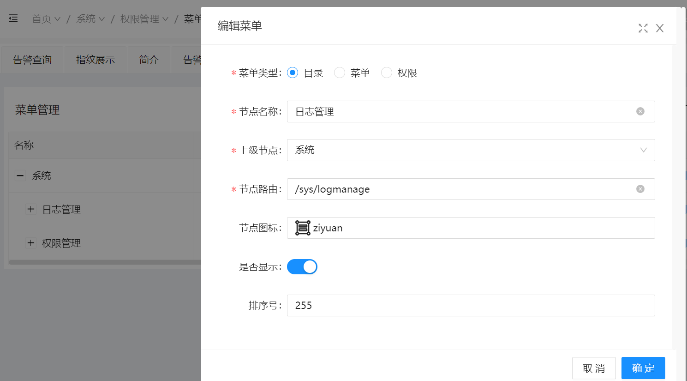
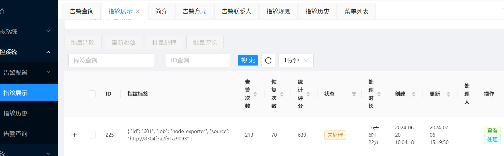
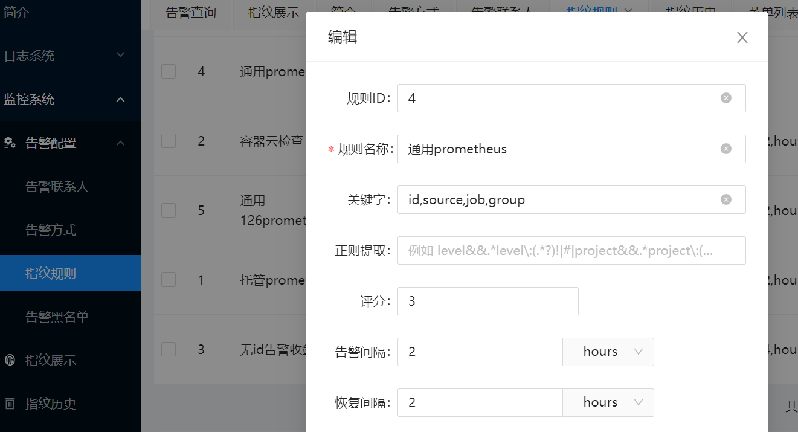
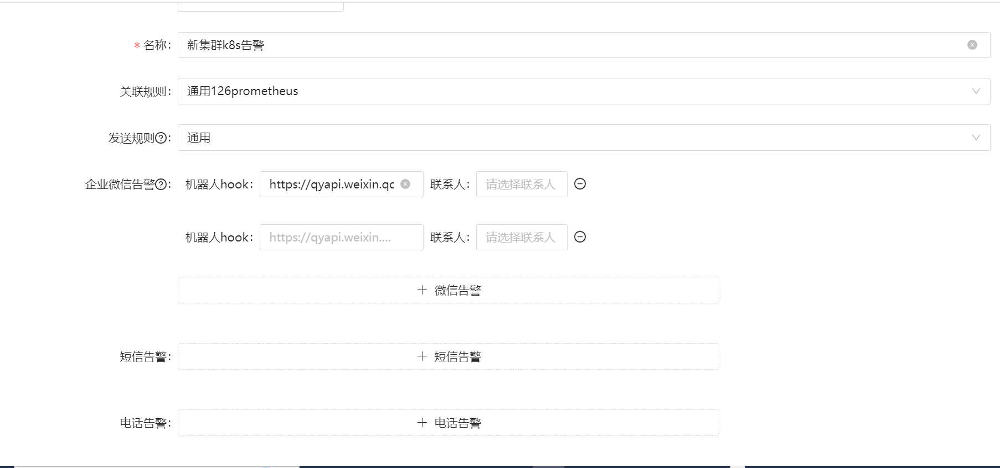
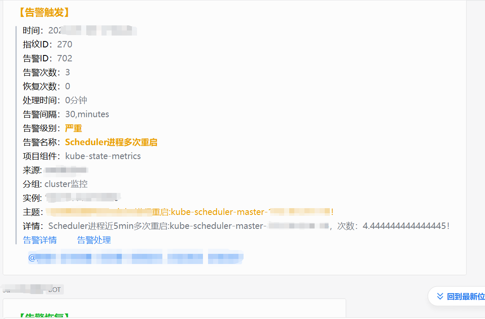
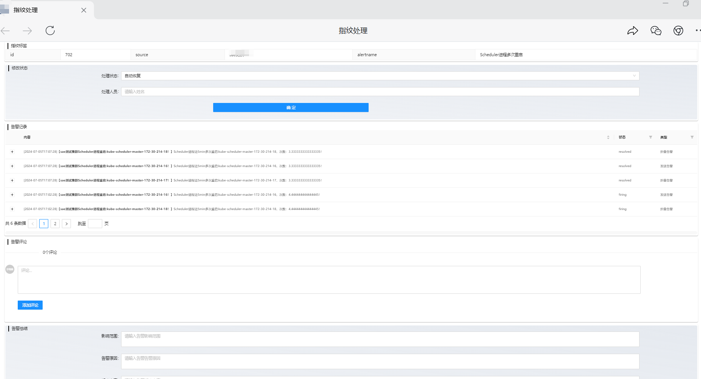
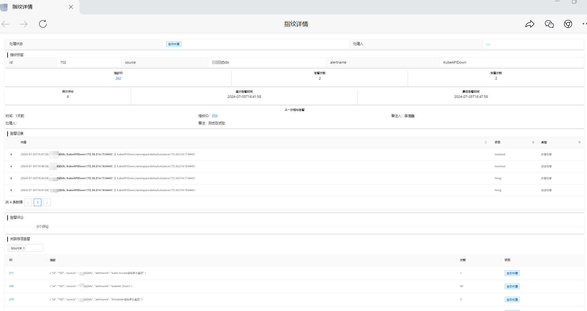
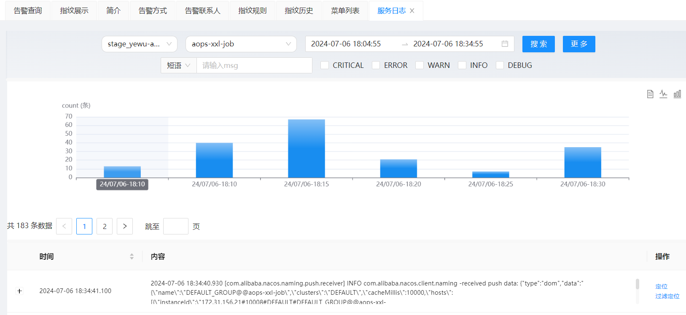
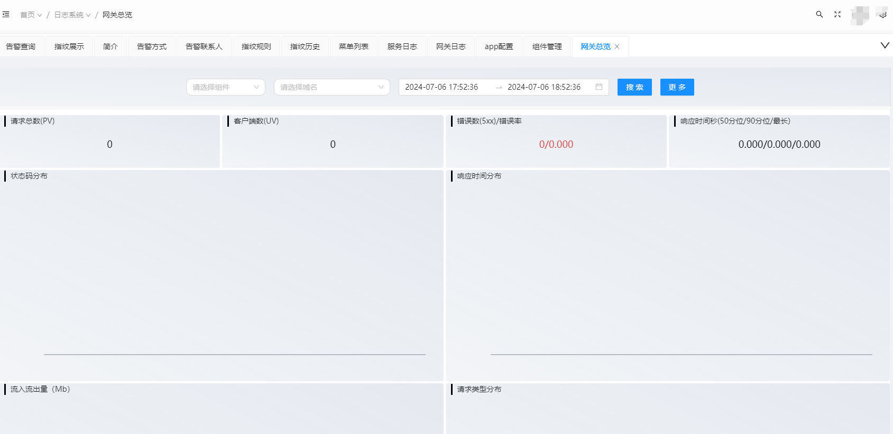
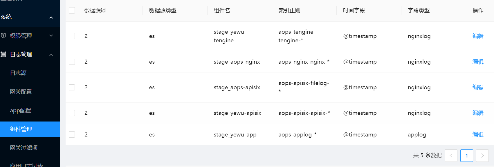

## 基于Django + Vue3 + ant-design UI前后端分离的告警系统和日志系统
> 整个项目采用了mysql,redis,es做中间件，celey做任务异步，权限等都有涉及缓存，高并发锁，apschedule定时清理，guncicorn启动

运维管理系统 Demo 地址: http://demo.zengxin.cn
username: admin
password: 123456

**权限管理**

基于RBAC设计，可页面灵活配置人员菜单按钮权限



**告警系统**

主要功能设计如下几个点：
1. 根据自定义label组合制定告警指纹，聚合同类告警,指纹展示大盘，保障人员主要盯这个盘即可，处理完了消除进指纹历史，可批量评论处理，重新收敛(去除缓存，下次告警不会沉默，主要针对告警间隔由长到短的修改操作)，当涉及自动恢复类告警的时候只由恢复次数大于等于告警次数才证明这个指纹告警真正结束，因为告警被聚合了，里面可能还有其他同类告警没有恢复完全



2. 高并发锁记录指纹id的告警次数和恢复次数，告警和恢复都有自定义设置间隔时间，同类指纹指定时间间隔内不会重复发送告警，避免告警风暴，可再指纹规则中配置，指纹label也可从告警主题和详情中正则提取做精细分类



3. 告警方式有钉钉，企业微信，邮件，短信，自定义配置,另外可配置根据label值自定义分组告警更加灵活精确，告警信息包括告警查看和告警处理链接直接跳转平台在线处理



企业微信告警样式示例，邮件钉钉类似差不多


告警处理页面可修改告警状态，忽略处理中等，另外可以评论告警，记录处理过程，总结告警原因，解决方案和影响范围，可做告警知识库，下一次相似告警出来，能在告警查看页面关联上相似告警的处理过程做借鉴。告警查看中同时底下还有自由选择同类存货告警做联合查看
告警处理页面


告警详情页面



**日志系统**
分为网关nginx日志和app应用日志两种，先在系统管理配置日志源，使用elk等日志收集工具到es,主要针对es接口封装做查询，聚合，采用es search_after 加速分页搜索，可定位日志，和过滤定位日志，日志系统针对性比较强，需要es日志字段啥的匹配，可能看懂代码的人可以研究使用下，部署到能使用起来比较繁琐，后期可以使用假数据塞到es做下展示
其中es需要打开id_field_data.enabled
```
PUT _cluster/settings
{
"persistent": {
"indices.id_field_data.enabled": true
}
}
```
1. 服务应用日志，logstash等加工到es中必须索引以应用名结尾，例如aops-applog-xxl-job，xxl-job就是应用名(查询拼接就是这么拼的，其实利用索引做区分也快一点)，可以改代码appquery接口哈,时间范围可能自动加8小时



applog es字段如下：
```
{
clusterid:"xxl-job",
@timestamp:"2024-07-06T14:45:30.123Z",
host_name:"node-172-31-156-22",
traceId:"",
level:"",
className:"",
log_path:"/data/aops/applogs/aops-xxl-job/aops-xxl-job/paas.log",
message:"xxx"
}
```

2. 网关总览大盘 es中必须有http_host字段做域名名



nginxlog es字段如下：
```
{
domain:"fenxiaobao.com",
@timestamp:"2024-07-06T14:45:30.123Z",
client_ip:"请求端IP",
status:200,
request_method:"GET",
request_time:0.2,
log_path:"/data/aops/fenxiaobao_com.log",
message:"xxx"
}
```

3. 组件管理配置 es 前缀索引，分类nginxlog app和网关配置可用ops-manage-back/apps/om_logsearch/crontab_tasks/appconfig_add.py,gateconfig_add.py 自动收集


**部署步骤**
1. 首先根据./ops-manage-back/docker_* 准备好es,mysql，redis中间件，redis用单节点的，可以参考目录下的readme,
```
登录mysql
CREATE DATABASE IF NOT EXISTS ops_manage DEFAULT CHARSET utf8 COLLATE utf8_general_ci;
use ops_manage;
使用./ops-manage-back/initdir/ops_manage2.sql source到mysql

```
2. 部署后端ops-manage-back,可以参考./ops-manage-back/README.md,Dockerfile,run.sh注意：其中基础镜像都是仓库是不能访问的哈，可以自己build一个cnetos8:python3 的基础镜像运行，yum install mysql-devel等。
先修改./ops-manage-back/.local/env里面的环境变量 mysl,redis，es 改成自己的
本地运行
```
pip3 install --no-cache-dir -r requirements.txt -i https://mirrors.aliyun.com/pypi/simple/ --trusted-host mirrors.aliyun.com
python3 manager.py runserver 0:8000
```

3. 部署alarm-consumer告警消息处理客户端，进入./alarm-consumer目录下，改动./alarm-consumer.env 设置mysql,redis,es，OPS_DOMAIN后端地址等
```
pip3 install --no-cache-dir -r requirements.txt -i https://mirrors.aliyun.com/pypi/simple/ --trusted-host mirrors.aliyun.com
python3 -m celery -A celery_tasks worker -l info -Q ${OPS_TASK_NAME:-ops_alarm_consumer} -c 15
```

4. 部署前端ops-manage-front,进入./ops-manage-front目录下,安装nodejs 16.18.0，可以使用nvm管理
```
yarn install
修改.env.development中的后端api地址
npm run dev
```

5. 测试告警,同时直接对接prometheus告警
```
#alertmanager.yaml
webhook_configs:
    - url: 'http://127.0.0.1:8000/ops-manage/v1/api/alarm/alert'
    send_resolved: true
```
```
curl --location 'http://127.0.0.1:8000/ops-manage/v1/api/alarm/alert' \
--header 'Content-Type: application/json' \
--data '{"alerts":[
    {
    "status": "resolved",
    "labels": {
        "id":502,
        "severity":"一般",
        "alertname":"mem使用率过高",
        "job":"aops-nodeexport",
        "group":"节点监控",
        "source":"10.111.1.14:9093",
        "instance":"10.110.1.18",
        "time_range":"24"
    },
    "annotations": {
        "summary": "测试告警002",
        "description": "测试告警001-desc"
        }
    }
]}'
```

6. 维护alarm系统，删除历史告警指纹等，mysql和es中的历史数据，保证系统长期快速运行
删除脚本参考./scripts/ops-alarm_historydel.py

****


**后续**
有什么二次开发啥的可以联系本人：v:aiwansheadmin
后续会迭代开发gin+vue3 的基于k8s+jenkins+harbor的发布系统，包含构建，代码检测，灰度发布，金丝雀布回退等操作，全力助力云原生！！！

## License
Everything is [GPL v3.0](https://www.gnu.org/licenses/gpl-3.0.html).